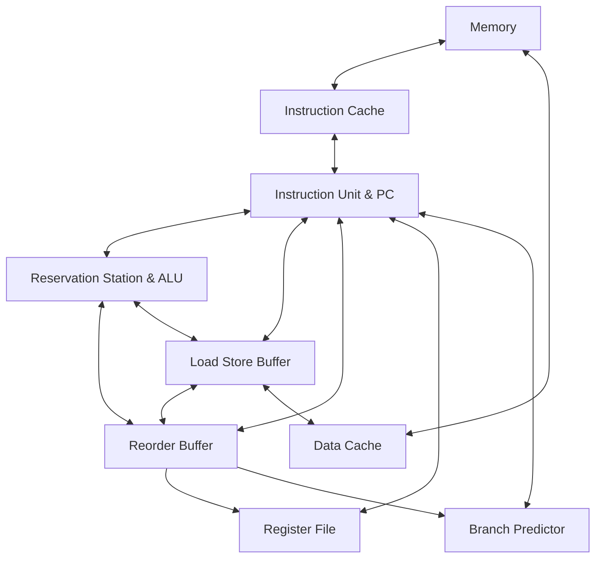

# RISC-V-CPU

A toy RISC-V-CPU designed using Verilog. [Assignment for ACM-ClassCourse-2022](https://github.com/ACMClassCourse-2022/RISC-V-CPU-2023).

## Overview
Below is the diagram for the CPU.

Since the CPU only contains one ALU and one LSB, we connect every two of RS, LSB and ROB for data communication and forwarding, instead of using a Common Data Bus. 

### Cache
Cache includes Instruction Cache (ICache) and Data Cache (DCache).
ICache is used to read instruction.
DCache is used to load and store data from memory. All load/stores should be through DCache.

### Instruction Unit
Instruction unit consists of Program Counter (PC) and some logical units.
In each clock cycle, it fetches and decodes the current instruction from ICache and issues it to proper unit.

### Reorder Buffer
Reorder Buffer records information and states for unfinished instructions. It renames registers by the RoB index to boost out-of-order execution and ensures that instructions are commited in order for correctness.

### Load Store Buffer
Load Store Buffer is used to commit load/store instructions.
It ensures that all load/store instructions are commited in order.

### Register File
Register file includes both registers and their dependency information.

### Reservation Station
The reservation station reserves instructions to calculate and its source dependency. It also includes the ALU which does the calculation.

### Predictor
Predict the branch instruction for efficiency.Plan to implement 2-bit saturation counter branch predictor.

