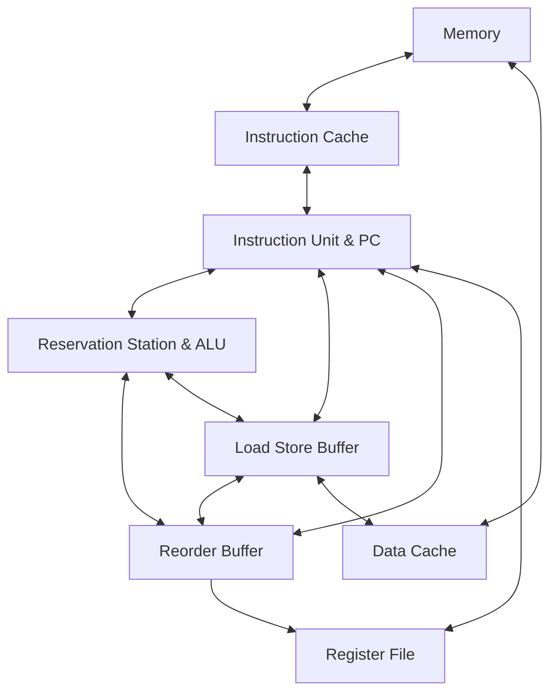

# RISC-V-CPU

A toy RISC-V-CPU designed using Verilog. [Assignment for ACM-ClassCourse-2022](https://github.com/ACMClassCourse-2022/RISC-V-CPU-2023).

## Overview
Below is the diagram for the CPU.

Since the CPU only contains one ALU and one LSB, we connect every two of RS, LSB and ROB for data communication, instead of using a Common Data Bus. 
